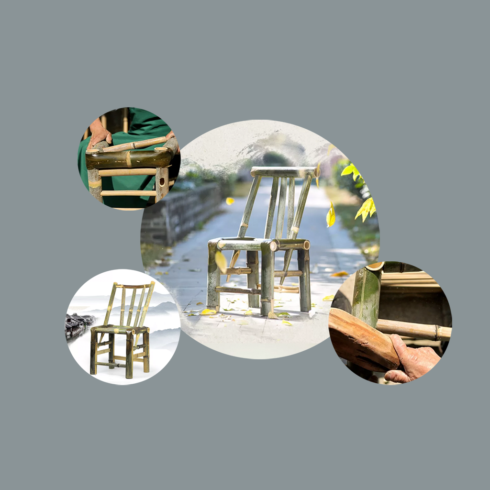

## 欢迎来到 手工编织藤椅练习记录

手工编织的藤椅轻巧大方，那些细密交织的藤条古朴、清爽。制作编织藤椅需要不断的练习，才可把握藤椅的细腻之处，大自然亲密融合，富有泥土气息的小藤条做成精美轻巧的藤椅。如果你也喜欢编织藤椅，这款应用可以帮助你随时记录和编辑练习编织藤椅的技巧和特点，以及进度状态，帮助你分析自己的编织藤椅技能，制作出具有特别风格田园藤椅。

如果您遇到什么需要解答的问题，请发送您的问题到以下邮箱。

我们将第一时间为您解答。

### 邮箱地址: zhanghesongyuan7@126.com

谢谢！
